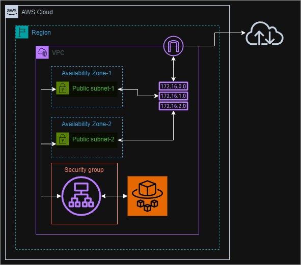
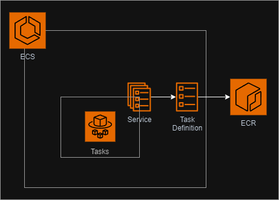
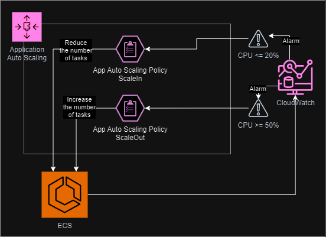

# Logo DevOps Bootcamp - Final Project

Welcome to the final project of the Logo DevOps Bootcamp. The following tasks were performed in this project:

- Create a basic React.js app
- Create a Dockerfile to dockerize the app
- Create the Kubernetes manifests
- Design a CI/CD pipeline for GitLab to deploy the app
- Use Terraform to provision the infrastructure on AWS

## Table of Contents

## 1. AWS Infrastructure

### 1.1. EC2

This module contains the following resources:

- **Internet Gateway:** This resource is used to connect the VPC to the internet.
- **Route Table:** Connects the VPC to the internet gateway.
- **Subnets:** Public and private subnets.
- **Security Groups:** For controlling resource with inbound and outbound rules.
- **Application Load Balancer:** A load balancer serves as the single point of contact for clients.
- **Load Balancer Target Group:** A target group tells a load balancer where to direct traffic to.
- **VPC:** A virtual private cloud

### 1.2. ECS

This module contains the following resources:

- **ECS Cluster:** A logical grouping of tasks or services.
- **ECS Task Definition:** A blueprint for the application.
- **ECS Service:** To run and maintain a specified number of instances of a task definition simultaneously in an ECS cluster.

### 1.3. Auto Scaling & CloudWatch

This module contains the following resources:

- **App Autoscaling Policies:** To scale the ECS service.
- **App Autoscaling Targets:** Which resources to scale.
- **Metric Alarms:** Create alarms for specific metrics and run actions based on those alarms.
- **Dahsboard:** Create a dashboard to visualize the metrics.

