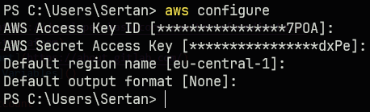

# Logo DevOps Bootcamp - Final Project

Welcome to the final project of the Logo DevOps Bootcamp. The following tasks were performed in this project:

- Create a basic React.js app
- Create a Dockerfile to dockerize the app
- Create the Kubernetes manifests
- Design a CI/CD pipeline for GitLab to deploy the app
- Use Terraform to provision the infrastructure on AWS

## Table of Contents

- [1. Usage](#1-usage)
  - [1.1. AWS Account](#11-aws-account)
  - [1.2. AWS CLI](#12-aws-cli)
  - [1.3. Terraform](#13-terraform)
  - [1.4. GitLab Account](#14-gitlab-account)
  - [1.5. Environment Variables](#15-environment-variables)
  - [1.6. Run the Project](#16-run-the-project)
- [2. AWS Infrastructure](#2-aws-infrastructure)
  - [2.1. EC2](#21-ec2)
  - [2.2. ECS](#22-ecs)
  - [2.3. Auto Scaling & CloudWatch](#23-auto-scaling--cloudwatch)
- [3. CI/CD Pipeline](#3-cicd-pipeline)
- [4. Dockerfile](#4-dockerfile)
- [5. Kubernetes](#5-kubernetes)
- [6. Ansible](#6-ansible)
- [7. License](#7-license)

## 1. Usage

Prequisites:

- AWS Account
- AWS CLI
- Terraform
- GitLab Account
- [Environment Variables]()

### 1.1. AWS Account

[Create an AWS account](https://aws.amazon.com/resources/create-account/) and create an IAM user with the following policies:

<details>
<summary>AmazonEC2ContainerRegistryPowerUser</summary>
<pre><code>{
    "Version": "2012-10-17",
    "Statement": [
        {
            "Effect": "Allow",
            "Action": [
                "ecr:GetAuthorizationToken",
                "ecr:BatchCheckLayerAvailability",
                "ecr:GetDownloadUrlForLayer",
                "ecr:GetRepositoryPolicy",
                "ecr:DescribeRepositories",
                "ecr:ListImages",
                "ecr:DescribeImages",
                "ecr:BatchGetImage",
                "ecr:GetLifecyclePolicy",
                "ecr:GetLifecyclePolicyPreview",
                "ecr:ListTagsForResource",
                "ecr:DescribeImageScanFindings",
                "ecr:InitiateLayerUpload",
                "ecr:UploadLayerPart",
                "ecr:CompleteLayerUpload",
                "ecr:PutImage"
            ],
            "Resource": "*"
        }
    ]
}</code></pre>
</details>

<details>
<summary>TerraformPolicy</summary>
<pre><code>{
    "Version": "2012-10-17",
    "Statement": [
        {
            "Effect": "Allow",
            "Action": [
                "iam:GetPolicy",
                "iam:CreatePolicy",
                "iam:DeleteRolePolicy",
                "iam:DeleteRole",
                "iam:CreateRole",
                "iam:AttachRolePolicy",
                "iam:GetRole",
                "iam:GetPolicyVersion",
                "iam:ListRolePolicies",
                "iam:ListAttachedRolePolicies",
                "iam:ListPolicyVersions",
                "iam:ListInstanceProfilesForRole",
                "iam:DetachRolePolicy",
                "iam:PassRole",
                "ec2:*",
                "elasticloadbalancing:DescribeLoadBalancers",
                "elasticloadbalancing:DescribeTargetGroups",
                "elasticloadbalancing:CreateLoadBalancer",
                "elasticloadbalancing:CreateTargetGroup",
                "elasticloadbalancing:ModifyLoadBalancerAttributes",
                "elasticloadbalancing:ModifyTargetGroupAttributes",
                "elasticloadbalancing:DescribeLoadBalancerAttributes",
                "elasticloadbalancing:DescribeTargetGroupAttributes",
                "elasticloadbalancing:DescribeTags",
                "elasticloadbalancing:DeleteTargetGroup",
                "elasticloadbalancing:DeleteLoadBalancer",
                "elasticloadbalancing:SetSecurityGroups",
                "elasticloadbalancing:CreateListener",
                "elasticloadbalancing:DeleteListener",
                "elasticloadbalancing:ModifyListener",
                "elasticloadbalancing:DescribeListeners",
                "elasticloadbalancing:ModifyTargetGroup",
                "ecs:CreateCluster",
                "ecs:CreateService",
                "ecs:DeleteCluster",
                "ecs:DeleteService",
                "ecs:DeleteTaskDefinitions",
                "ecs:DescribeClusters",
                "ecs:RegisterTaskDefinition",
                "ecs:PutClusterCapacityProviders",
                "ecs:DescribeTaskDefinition",
                "ecs:DeregisterTaskDefinition",
                "ecs:DescribeServices",
                "ecs:UpdateService",
                "application-autoscaling:RegisterScalableTarget",
                "application-autoscaling:DescribeScalableTargets",
                "application-autoscaling:ListTagsForResource",
                "application-autoscaling:DeregisterScalableTarget",
                "application-autoscaling:PutScalingPolicy",
                "application-autoscaling:DeleteScalingPolicy",
                "application-autoscaling:DescribeScalingPolicies",
                "cloudwatch:PutMetricAlarm",
                "cloudwatch:DescribeAlarms",
                "cloudwatch:DeleteAlarms",
                "cloudwatch:ListTagsForResource",
                "ecs:UpdateCluster",
                "ecs:ListTagsForResource",
                "cloudwatch:PutDashboard",
                "cloudwatch:DeleteDashboards",
                "cloudwatch:GetDashboard"
            ],
            "Resource": "*"
        }
    ]
}</code></pre>
</details></br>

Then [create a new access key and secret key](https://docs.aws.amazon.com/IAM/latest/UserGuide/id_credentials_access-keys.html#Using_CreateAccessKey) for the user. You will need these keys to configure the AWS CLI. Note that you can only view the secret key once, so make sure to save it somewhere safe.

### 1.2. AWS CLI

[Install the AWS CLI](https://docs.aws.amazon.com/cli/latest/userguide/getting-started-install.html) and configure it with the access key and secret key you created in the previous step.

Configure the AWS CLI with the `aws configure` command, enter the `Access Key ID` and `Secret Access Key` you created in the previous step and set the default region:



### 1.3. Terraform

[Install Terraform](https://learn.hashicorp.com/tutorials/terraform/install-cli) and add it to your path.

### 1.4. GitLab Account

[Create a GitLab account](https://about.gitlab.com/) and create a project from this repository.

### 1.5. Environment Variables

Create the GitLab variables below in the project settings (Settings > CI/CD > Variables):

- **AWS_ACCESS_KEY_ID:** The access key ID you created in the previous step. (Masked)
- **AWS_SECRET_ACCESS_KEY:** The secret access key you created in the previous step. (Masked)
- **TF_VAR_accountID:** Your AWS account ID. (Masked)
- **TF_VAR_clusterName:** The name of the ECS cluster. (Masked)
- **TF_VAR_containerPort:** The port the app is running on.
- **TF_VAR_region:** The AWS region. (Masked)
- **TF_VAR_serviceName:** The name of the ECS service. (Masked)

If you run the project locally, you can also set these variables in the `terraform.tfvars` file like this:

```
accountID     = YOUR_AWS_ACCOUNT_ID
containerPort = CONTAINER_PORT
region        = AWS_REGION
clusterName   = CLUSTER_NAME
serviceName   = SERVICE_NAME
imageURL      = IMAGE_URL
```

### 1.6. Run the Project

To run the project, you can either run it locally or in GitLab. If you run it on GitLab just run the pipeline. If you run it locally, follow the steps below:

```bash
# You can get this from your GitLab account settings.
# Make sure selected api and read_api scopes. 
# https://gitlab.com/-/profile/personal_access_tokens
export $GITLAB_ACCESS_TOKEN=YOUR_GITLAB_ACCESS_TOKEN

export $GITLAB_USERNAME=YOUR_GITLAB_USERNAME
export $PROJECT_ID=YOUR_GITLAB_PROJECT_ID
export $TF_STATE_NAME="default"

terraform init \
    -backend-config="address=https://gitlab.com/api/v4/projects/$PROJECT_ID/terraform/state/$TF_STATE_NAME" \
    -backend-config="lock_address=https://gitlab.com/api/v4/projects/$PROJECT_ID/terraform/state/$TF_STATE_NAME/lock" \
    -backend-config="unlock_address=https://gitlab.com/api/v4/projects/$PROJECT_ID/terraform/state/$TF_STATE_NAME/lock" \
    -backend-config="username=$GITLAB_USERNAME" \
    -backend-config="password=$GITLAB_ACCESS_TOKEN" \
    -backend-config="lock_method=POST" \
    -backend-config="unlock_method=DELETE" \
    -backend-config="retry_wait_min=5"
```

After running the command above, you can run the following commands to deploy the infrastructure:

```bash
terraform apply
```

If the deployment is successful, you should see the service details in your AWS account as follows:  


And the application:  


## 2. AWS Infrastructure

### 2.1. EC2

This module contains the following resources:

- **Internet Gateway:** This resource is used to connect the VPC to the internet.
- **Route Table:** Connects the VPC to the internet gateway.
- **Subnets:** Public and private subnets.
- **Security Groups:** For controlling resource with inbound and outbound rules.
- **Application Load Balancer:** A load balancer serves as the single point of contact for clients.
- **Load Balancer Target Group:** A target group tells a load balancer where to direct traffic to.
- **VPC:** A virtual private cloud


### 2.2. ECS

This module contains the following resources:

- **ECS Cluster:** A logical grouping of tasks or services.
- **ECS Task Definition:** A blueprint for the application.
- **ECS Service:** To run and maintain a specified number of instances of a task definition simultaneously in an ECS cluster.


### 2.3. Auto Scaling & CloudWatch

This module contains the following resources:

- **App Autoscaling Policies:** To scale the ECS service.
- **App Autoscaling Targets:** Which resources to scale.
- **Metric Alarms:** Create alarms for specific metrics and run actions based on those alarms.
- **Dahsboard:** Create a dashboard to visualize the metrics.


In this project we have two alarms:

- **scaleInCPUBelow20:** If the CPU utilization is below 20% for 30 seconds, run the scale in policy.
- **scaleOutCPUAbove50:** If the CPU utilization is above 50% for 30 seconds, run the scale out policy.

**Alarms**


**Scale In Policy | Alarm History**


**Dashboard**


## 3. CI/CD Pipeline

In this project, we use GitLab CI/CD to deploy the application. The pipeline is triggered when a commit is pushed to the `main` branch. The pipeline consists of the following stages:

- **validate:**
    - **npm_run:** Runs `npm run build` to build the app to make sure there are no errors.
    - **terraform_validate:** Runs `terraform validate` to validate the Terraform files.
- **build:**
    - **docker_build_image:** Builds the Docker image and pushes it to the ECR repository. If we set `DOCKER_IMAGE_AUTO_DEPLOY` variable to `true`, it will automatically build and push the image when the pipeline is triggered.
    - **terraform_build:** Runs `terraform plan` to create an execution plan. 
- **deploy:**
    - **terraform_deploy:** Runs `terraform apply` to deploy the infrastructure. If we set `TF_AUTO_DEPLOY` variable to `true`, it will automatically deploy the infrastructure when the pipeline is triggered.
- **cleanup:**
    - **terraform_destroy:** Runs `terraform destroy` to destroy the infrastructure.


## 4. Dockerfile

In this project we have a multi-stage [Dockerfile](./Dockerfile). The image size is 1.05 MB on ECR.


| Stage | Command | Parameter | Description |
| - | - | - | - |
| Stage 1. | FROM | node:lts-alpine as install | Use node:lts-alpine as base image and name the stage _install_ |
| | WORKDIR | /app | Set the working directory to /app |
| | COPY | app/package*.json . | Copy package.json and package-lock.json to the working directory |
| | RUN | npm i | Install dependencies |
| Stage 2. | FROM | node:lts-alpine as build | Use node:lts-alpine as base image and name the stage _build_ |
| | WORKDIR | /app | Set the working directory to /app |
| | COPY | --from=install ./app ./ | Copy the dependencies from the _install_ stage |
| | COPY | app/public ./public | Copy the public folder |
| | COPY | app/src ./src | Copy the src folder |
| | RUN | npm run build | Build the app |
| Stage 3. | FROM | busybox:stable-musl | Use busybox:stable-musl as base image |
| | WORKDIR | /app | Set the working directory to /app |
| | COPY | --from=build ./app/build ./ | Copy the build folder from the _build_ stage |
| | CMD | httpd -f -v -p 3000 | Run the app |

## 5. Kubernetes

In this project we have two Kubernetes files:

- [**deployment.yaml:**](./k8s/deployment.yaml) The Deployment specifies the name of the deployment, the number of replicas to create, and the container image to use. In this case, the image is "scnplt/reactapp:v1". The Deployment also defines a selector to match the labels of the Pods it manages. The Pod template specifies the container name, image, and port to use.
- [**service.yaml:**](./k8s/service.yaml) The Service specifies the name of the service, the type of service, and the ports to use. In this case, the service is of type NodePort, which exposes the Service on a port on each node in the cluster. The Service also specifies a selector to match the labels of the Pods it should route traffic to.

## 6. Ansible

In this project we have an Ansible playbook. This playbook monitors disk usage and if it exceeds 90%, it sends an email to the specified email address.

For this playbook to work, you need to set the following variables in the `ansible/vars.yaml` file:

```yaml
sender_address: SENDER_EMAIL_ADDRESS
sender_password: SENDER_EMAIL_PASSWORD
receiver_address: RECEIVER_EMAIL_ADDRESS
```

Then you can run the playbook with the following command:

```bash
ansible-playbook ansible/playbook.yaml
```

## 7. License

```
MIT License

Copyright (c) 2023 Sertan Canpolat

Permission is hereby granted, free of charge, to any person obtaining a copy
of this software and associated documentation files (the "Software"), to deal
in the Software without restriction, including without limitation the rights
to use, copy, modify, merge, publish, distribute, sublicense, and/or sell
copies of the Software, and to permit persons to whom the Software is
furnished to do so, subject to the following conditions:

The above copyright notice and this permission notice shall be included in all
copies or substantial portions of the Software.

THE SOFTWARE IS PROVIDED "AS IS", WITHOUT WARRANTY OF ANY KIND, EXPRESS OR
IMPLIED, INCLUDING BUT NOT LIMITED TO THE WARRANTIES OF MERCHANTABILITY,
FITNESS FOR A PARTICULAR PURPOSE AND NONINFRINGEMENT. IN NO EVENT SHALL THE
AUTHORS OR COPYRIGHT HOLDERS BE LIABLE FOR ANY CLAIM, DAMAGES OR OTHER
LIABILITY, WHETHER IN AN ACTION OF CONTRACT, TORT OR OTHERWISE, ARISING FROM,
OUT OF OR IN CONNECTION WITH THE SOFTWARE OR THE USE OR OTHER DEALINGS IN THE
SOFTWARE.
```